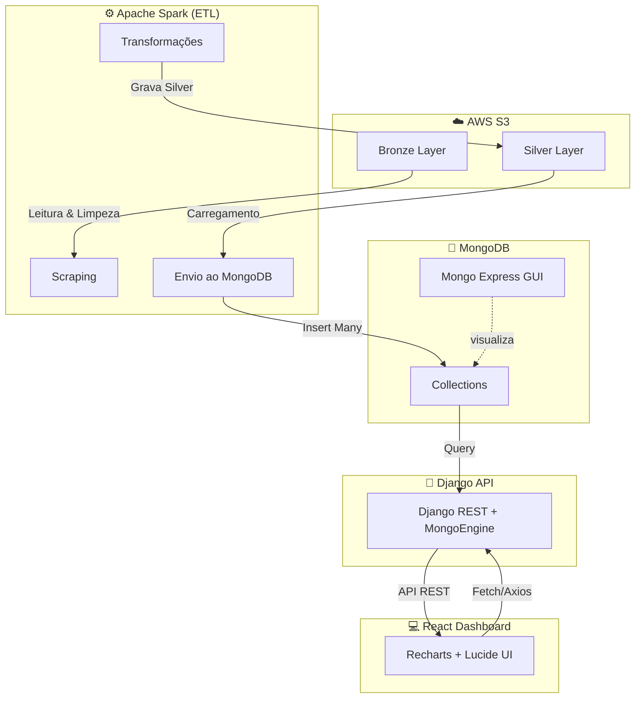

# 🍇 Embrapa Wine Data — Django + Spark + MongoDB + React + Docker


## 🧩 Visão Geral

Este projeto cria um **pipeline completo de dados** que coleta, transforma, armazena e disponibiliza informações sobre a **produção, comercialização, exportação e importação de vinhos no Brasil**, baseadas nos dados públicos da **Embrapa Uva & Vinho**.

A aplicação é composta por 4 principais camadas:

1. **ETL (Spark + S3 + MongoDB)** → Coleta e processamento dos dados.
2. **API (Django REST Framework + MongoEngine)** → Exposição dos dados em endpoints REST.
3. **Frontend (React + Recharts)** → Dashboard interativo com filtros e gráficos.
4. **Infraestrutura (Docker Compose)** → Orquestração dos serviços.

---

## 🏗️ Arquitetura do Sistema



---

## ⚙️ Serviços no Docker

| Serviço           | Descrição                         | Porta                          |
| ----------------- | --------------------------------- | ------------------------------ |
| **web**           | API Django (Backend)              | `8000`                         |
| **mongo**         | Banco de dados MongoDB            | `27017`                        |
| **mongo-express** | GUI web para o MongoDB            | `8081`                         |
| **spark-master**  | Ambiente Spark + Jupyter Notebook | `8889`, `8083`, `8040`, `7077` |
| **wine-frontend** | Dashboard React                   | `3000`                         |

---

## 🧠 Principais Tecnologias

* **Backend:** Django REST Framework + MongoEngine
* **Banco de Dados:** MongoDB
* **ETL / Big Data:** Apache Spark (PySpark)
* **Cloud:** Amazon S3
* **Frontend:** React + Recharts + Lucide Icons
* **Infraestrutura:** Docker & Docker Compose
* **Autenticação de variáveis:** `python-decouple`

---

## 🚀 Como Executar o Projeto

### 1️⃣ Clonar o repositório

```bash
git clone https://github.com/seu-usuario/embrapa-wine-data.git
cd embrapa-wine-data
```

### 2️⃣ Configurar variáveis de ambiente

Crie um arquivo `.env` na raiz do projeto com as variáveis abaixo:

```bash
DEBUG=True
MDB_HOST=mongo
MDB_PORT=27017
MDB_USER=admin
MDB_PASS=admin123
MDB_NAME=embrapa_wine

AWS_ACCESS_KEY=SUACHAVE
AWS_SECRET_KEY=SUASECRET
AWS_DESTINY=seu-bucket
AWS_DESTINY_KEY=seu-bucket
AWS_LOCAL=us-east-1
```

### 3️⃣ Subir os containers

```bash
docker compose up --build
```

A aplicação estará disponível em:

* Django API → [http://localhost:8000/api](http://localhost:8000/api/)
* Mongo Express → [http://localhost:8081](http://localhost:8081)
* Spark Jupyter → [http://localhost:8889](http://localhost:8889)
* Dashboard React → [http://localhost:3000](http://localhost:3000)

---

## 📊 Frontend — Dashboard de Vinhos

O frontend React exibe um **painel interativo** com abas e filtros para:

* Comercialização
* Produção
* Exportação
* Importação
* Processamento de uvas

As visualizações utilizam **Recharts**, com gráficos de barras e pizza, além de indicadores de resumo e comparativo de produção/exportação.

---

## 🔄 ETL com Spark

O pipeline Spark realiza:

1. **Scraping dos dados da Embrapa** (`scrap_embrapa.ipynb`)

   * Faz requests HTML
   * Extrai tabelas via BeautifulSoup
   * Converte e envia para o S3 (camada *bronze*)

2. **Transformação e limpeza dos dados** (`spark_transform.ipynb`)

   * Limpeza de colunas e caracteres corrompidos
   * Conversão de tipos (string → numérico)
   * Geração da camada *silver* no S3
   * Envio final para o **MongoDB**

3. **Carga automatizada no MongoDB**

   * Via `MongoDBLoaderFromS3.py` usando batches Spark + PyMongo.

---

## 📡 API Endpoints (principais)

| Endpoint                       | Descrição                               |
| ------------------------------ | --------------------------------------- |
| `/api/Comercio/?ano=2024`      | Dados de comercialização                |
| `/api/Producao/?ano=2024`      | Produção de vinhos                      |
| `/api/Exportacao/?ano=2024`    | Exportações por país                    |
| `/api/Importacao/?ano=2024`    | Importações por país                    |
| `/api/Processamento/?ano=2024` | Processamento de uvas                   |
| `/api/comparativo/<ano>/`      | Comparativo entre produção e exportação |

---

## 🧰 Estrutura de Pastas

```
📦 embrapa-wine-data
├── embrapa/                 # App principal Django (models, views, serializers)
├── mongo/                   # Conexão e loaders do MongoDB
├── src/spark/spark-apps/    # Notebooks ETL com Spark e S3
├── wine-frontend/           # Aplicação React com Recharts
├── setup/                   # Configurações Django
├── Dockerfile               # Build da API Django
├── docker-compose.yml       # Orquestração dos serviços
├── requirements.txt
└── .env
```

---

## 🧪 Testes e Desenvolvimento

Rodar Django localmente (sem Docker):

```bash
python manage.py runserver
```

Rodar o frontend:

```bash
cd wine-frontend
npm install
npm start
```

Executar os notebooks Spark no container:

```bash
http://localhost:8889
```

---
