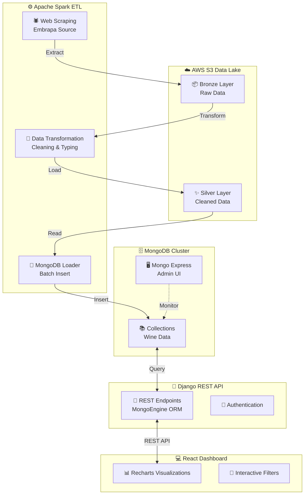

# 🍇 Embrapa Wine Data Analytics Platform

<div align="center">


**Plataforma completa de análise de dados da indústria vinícola brasileira**

[Visão Geral](#-visão-geral) • [Arquitetura](#️-arquitetura) • [Instalação](#-instalação-rápida) • [Documentação](#-documentação-da-api) • [Tecnologias](#-stack-tecnológico)

</div>

---

## 📋 Visão Geral

Pipeline end-to-end de engenharia de dados que coleta, processa e visualiza informações sobre a **produção, comercialização, exportação e importação de vinhos no Brasil**, utilizando dados públicos da **Embrapa Uva & Vinho**.

### ✨ Principais Funcionalidades

- 🔄 **ETL automatizado** com Apache Spark e armazenamento em camadas (Bronze/Silver)
- 📊 **Dashboard interativo** com visualizações dinâmicas e filtros avançados
- 🚀 **API RESTful** escalável com Django e MongoDB
- 🐳 **Infraestrutura containerizada** com Docker Compose
- ☁️ **Integração com AWS S3** para data lake
- 📈 **Análises comparativas** de produção vs exportação

---

## 🏗️ Arquitetura



---

## 🐳 Serviços Docker

| Serviço | Descrição | Portas | URL de Acesso |
|---------|-----------|--------|---------------|
| **web** | Django REST API | `8000` | http://localhost:8000/api |
| **mongo** | MongoDB Database | `27017` | - |
| **mongo-express** | MongoDB Admin UI | `8081` | http://localhost:8081 |
| **spark-master** | Spark + Jupyter Notebook | `8889`, `8083`, `8040`, `7077` | http://localhost:8889 |
| **wine-frontend** | React Dashboard | `3000` | http://localhost:3000 |

---

## 🚀 Instalação Rápida

### Pré-requisitos

- Docker 20.10+
- Docker Compose 2.0+
- Conta AWS (para S3)

### 1. Clone o repositório

```bash
git clone https://github.com/seu-usuario/embrapa-wine-data.git
cd embrapa-wine-data
```

### 2. Configure as variáveis de ambiente

Crie um arquivo `.env` na raiz do projeto:

```bash
# Django Settings
DEBUG=True
SECRET_KEY=your-secret-key-here

# MongoDB Configuration
MDB_HOST=mongo
MDB_PORT=27017
MDB_USER=admin
MDB_PASS=admin123
MDB_NAME=embrapa_wine

# AWS S3 Configuration
AWS_ACCESS_KEY=your-access-key
AWS_SECRET_KEY=your-secret-key
AWS_DESTINY=your-bucket-name
AWS_DESTINY_KEY=your-bucket-name
AWS_LOCAL=us-east-1
```

### 3. Execute a aplicação

```bash
docker compose up --build
```

Aguarde alguns minutos enquanto os containers são construídos e inicializados.

### 4. Acesse as aplicações

| Aplicação | URL | Credenciais |
|-----------|-----|-------------|
| Dashboard | http://localhost:3000 | - |
| API Django | http://localhost:8000/api | - |
| Mongo Express | http://localhost:8081 | admin / admin123 |
| Jupyter Notebook | http://localhost:8889 | Token exibido no log |

---

## 📊 Dashboard Interativo

O dashboard React oferece análises visuais completas com:

### Funcionalidades

- **📈 Múltiplas visualizações**: Gráficos de barras, pizza e linhas temporais
- **🔍 Filtros dinâmicos**: Por ano, categoria e país
- **📑 Sistema de abas**: Comercialização, Produção, Exportação, Importação e Processamento
- **💹 Comparativos**: Análise de produção vs exportação
- **📱 Responsivo**: Interface adaptável para mobile e desktop

### Capturas de Tela


---

## 🔄 Pipeline ETL

### Fluxo de Dados

```
1. EXTRAÇÃO → Web scraping da Embrapa (BeautifulSoup)
                ↓
2. BRONZE LAYER → Dados brutos salvos no S3
                ↓
3. TRANSFORMAÇÃO → Limpeza e tipagem com Spark
                ↓
4. SILVER LAYER → Dados processados no S3
                ↓
5. CARGA → Inserção em batch no MongoDB
```

### Notebooks Spark

1. **`scrap_embrapa.ipynb`** - Extração de dados
   - Web scraping das páginas da Embrapa
   - Parsing de tabelas HTML
   - Upload para S3 (bronze layer)

2. **`spark_transform.ipynb`** - Transformação
   - Limpeza de caracteres especiais
   - Conversão de tipos de dados
   - Validação e normalização
   - Geração da silver layer

3. **`MongoDBLoaderFromS3.py`** - Carga
   - Leitura batch do S3
   - Inserção otimizada no MongoDB
   - Logging e tratamento de erros

---

## 📡 Documentação da API

### Endpoints Disponíveis

#### Comercialização
```http
GET /api/Comercio/?ano=2024
```
Retorna dados de comercialização de vinhos no mercado interno.

#### Produção
```http
GET /api/Producao/?ano=2024
```
Dados de produção de vinhos e derivados.

#### Exportação
```http
GET /api/Exportacao/?ano=2024&pais=Italia
```
Volume e valor de exportações por país de destino.

#### Importação
```http
GET /api/Importacao/?ano=2024&pais=Argentina
```
Volume e valor de importações por país de origem.

#### Processamento
```http
GET /api/Processamento/?ano=2024
```
Quantidade de uvas processadas por variedade.

#### Comparativo
```http
GET /api/comparativo/2024/
```
Análise comparativa entre produção e exportação.

### Exemplo de Resposta

```json
{
  "ano": 2024,
  "data": [
    {
      "produto": "Vinho de Mesa",
      "quantidade": 125000000,
      "valor": 450000000
    }
  ],
  "total_registros": 15
}
```

---

## 🛠️ Stack Tecnológico

### Backend
- **Django 5.2+** - Framework web
- **Django REST Framework** - API RESTful
- **MongoEngine** - ODM para MongoDB
- **python-decouple** - Gerenciamento de variáveis

### Big Data & ETL
- **Apache Spark 3.5** - Processamento distribuído
- **PySpark** - Interface Python para Spark
- **boto3** - SDK AWS para Python
- **BeautifulSoup4** - Web scraping

### Database
- **MongoDB 8.2** - Banco de dados NoSQL
- **PyMongo** - Driver Python para MongoDB

### Frontend
- **React** - Biblioteca UI
- **Recharts** - Biblioteca de gráficos
- **Lucide React** - Ícones
- **Axios** - Cliente HTTP

### Infraestrutura
- **Docker & Docker Compose** - Containerização
- **AWS S3** - Object storage (Data Lake)

---

## 📁 Estrutura do Projeto

```
embrapa-wine-data/
├── 📂 embrapa/                    # App Django principal
│   ├── models.py                  # Models MongoEngine
│   ├── views.py                   # ViewSets da API
│   ├── serializers.py             # Serializadores DRF
│   └── urls.py                    # Rotas da API
├── 📂 mongo/                      # Configuração MongoDB
│   ├── connection.py              # Setup de conexão
│   └── MongoDBLoaderFromS3.py     # Carga
├── 📂 src/spark/spark-apps/       # Pipeline ETL
│   ├── scrap_embrapa.ipynb        # Extração
│   └── spark_transform.ipynb      # Transformação
├── 📂 wine-frontend/              # Aplicação React
│   ├── src/
│   │   ├── public/                # Componentes React
│   │   └── src/                   # Componente principal
├── 📂 setup/                      # Configurações Django
│   ├── settings.py
│   └── urls.py
├── 📄 docker-compose.yml          # Orquestração
├── 📄 Dockerfile                  # Build Django
├── 📄 requirements.txt            # Dependências Python
├── 📄 .env                        # Template de variáveis
└── 📄 README.md                   # Este arquivo
```

---

## 🧪 Desenvolvimento

### Executar Django localmente

```bash
# Criar ambiente virtual
python -m venv venv
source venv/bin/activate  # Linux/Mac
# ou
venv\Scripts\activate  # Windows

# Instalar dependências
pip install -r requirements.txt

# Executar servidor
python manage.py runserver
```

### Executar Frontend localmente

```bash
cd wine-frontend
npm install
npm start
```

### Acessar Jupyter Notebooks

```bash
# O token está nos logs do container
docker compose logs spark-master | grep token

# Acesse http://localhost:8889 e insira o token
```

### Executar testes

```bash
# Backend
python manage.py test

# Frontend
cd wine-frontend
npm test
```

---