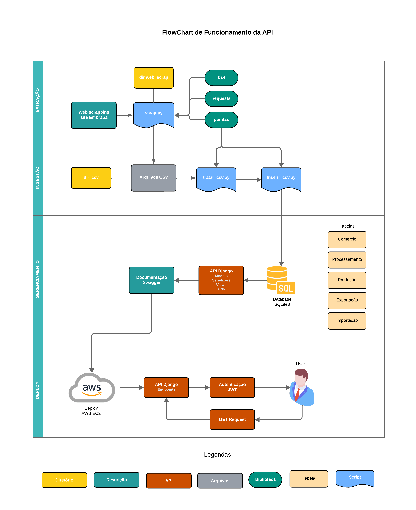

# Embrapa API

Embrapa API é uma interface desenvolvida com Django Rest Framework para facilitar o acesso ao rico banco de dados da Embrapa, que concentra informações detalhadas sobre uvas, vinhos e derivados. Esta API foi projetada para ser segura, eficiente e acessível para desenvolvedores, pesquisadores e entusiastas que desejam explorar ou integrar esses dados em seus projetos.

## 📊 Dados Disponíveis

A API oferece acesso a um extenso conjunto de dados relacionados a uvas, vinhos e derivados. Esses dados abrangem várias tabelas com informações sobre comércio, processamento, produção, importação e exportação de produtos vitivinícolas. Abaixo estão alguns exemplos das informações que você pode consultar:

- **Comércio**: Categorias e produtos comercializados, como espumantes, vinhos e sucos de uvas.
- **Processamento**: Tipos de uvas, como híbridas americanas e viníferas, além de outras classificações.
- **Produção**: Dados gerais de produção, como categorias de vinhos, tipos de uvas e outras informações relacionadas à viticultura.
- **Exportação e Importação**: Dados sobre países, tipos de produtos exportados e importados.

Esses dados são estruturados e podem ser acessados por meio de filtros, permitindo consultas detalhadas para análise e integração em outros projetos. A API cobre informações de **1970 a 2023**, oferecendo uma visão histórica e detalhada do mercado vitivinícola ao longo dos anos.

Para acessar todos os dados completos, você pode consultar a [tabela completa de dados disponíveis](https://github.com/milinull/Embrapa-API/blob/testes/dir_csv/dados_unicos.csv).

## ⚙️ Recursos Principais
- Acesso estruturado aos dados de uvas, vinhos e derivados.
- Suporte à autenticação via JWT (JSON Web Token).
- Documentação interativa utilizando Swagger.
- Exportação de tabelas em formato CSV para análise posterior.
- Filtros específicos para categorias e anos.

## 🔄 Fluxo de Funcionamento



## 💻 Tecnologias Utilizadas
- **Django**: Estrutura principal do backend.
- **Django Rest Framework**: Construção de endpoints de API.
- **SimpleJWT**: Implementação de autenticação segura via tokens JWT.
- **drf-yasg**: Geração de documentação interativa.
- **BeautifulSoup**: Web scraping para obtenção de dados.
- **Pandas**: Manipulação e exportação de dados em CSV.

## 🚨 Requisitos de Instalação
Certifique-se de ter o seguinte instalado:
- Python 3.12.2+
- Pip
- Virtualenv (opcional, mas recomendado)

### Passos de Instalação
1. Clone o repositório:
   ```bash
   git clone https://github.com/milinull/Embrapa-API
   cd embrapa-api
   ```

2. Crie e ative um ambiente virtual:
   ```bash
   python -m venv venv
   source venv/bin/activate  # No Windows: venv\Scripts\activate
   ```

3. Instale as dependências:
   ```bash
   pip install -r requirements.txt
   ```

4. Realize as migrações:
   ```bash
   python manage.py migrate
   ```

5. Inicie o servidor de desenvolvimento:
   ```bash
   python manage.py runserver
   ```

6. Acesse a documentação interativa em:
   ```
    http://localhost:8000/swagger/
   ```

## ✍️ Uso da API

### Credenciais de Teste
Para facilitar o teste da API, é possível usar o seguinte usuário de teste:

- **Usuário**: user_test
- **Senha**: senha_test123

### Autenticação JWT
1. Obtenha o token de acesso:
   - Endpoint: `POST /api/token/`
   - Corpo da requisição:
     ```json
     {
       "username": "seu_usuario",
       "password": "sua_senha"
     }
     ```

2. Renove o token:
   - Endpoint: `POST /api/token/refresh/`
   - Corpo da requisição:
     ```json
     {
       "refresh": "seu_refresh_token"
     }
     ```

3. Envie o token de acesso em cada requisição:
   ```
   Authorization: Bearer <seu_token_de_acesso>
   ```

### Exemplos de Endpoints
#### Produção
- `GET /producao/` - Retorna dados gerais de produção.
- `GET /producao/?search=<categoria>/` - Filtra dados de produção por categoria.

#### Importações
- `GET /importacao/` - Retorna dados gerais de importações.
- `GET /importacao/?search=<categoria>/` - Filtra dados de importação por categoria.

#### Exportações
- `GET /exportacao/` - Retorna dados gerais de exportações.
- `GET /exportacao/?search=<categoria>/` - Filtra dados de exportação por categoria.

---

## **🌐 Deploy na AWS**

A aplicação foi implantada em uma instância de servidor na AWS, configurada para permitir acesso público ao sistema.

### **Tecnologia Utilizada**

- **AWS EC2:** Utilizado para hospedar a aplicação, garantindo escalabilidade e flexibilidade.

A API está disponível publicamente em: [http://56.124.107.183:8000/swagger](http://56.124.107.183:8000/swagger)

---